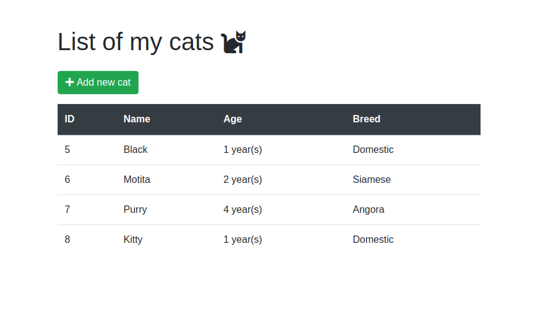

# Spring Demo

A sample app for storing your cats info. Made with Spring Framework and Angular.

Live demo: [Backend](https://spring-webmvc-sample.herokuapp.com/cats), [Frontend](https://spring-demo-3584d.firebaseapp.com/)

## Requirements

- Java 8
- Maven
- NPM

## Installing

### Backend

Go to `springbackend` directory and ...

1. Edit `src/main/resources/application/properties` and set the `store.path` to a local file path to save the data in JSON
2. Generate a WAR file with `mvn war:war` and deploy it to a Tomcat server

### Frontend

Go to `web-frontend` directory and ...

1. Edit `src/environments/environment.ts` and `src/environments/environment.prod.ts` to set the backend URL for development and production.
2. Run `npm start`
